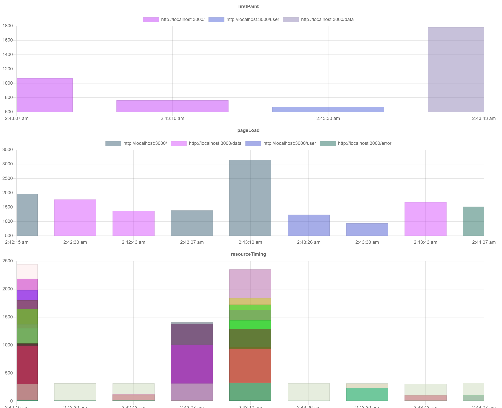

# MonitorX

### 这是什么 What's this

MonitorX 是一个 Web 前端数据分析工具，可帮助开发者采集以下信息：

MonitorX is a web frontend data analyse tool, it can help developers get infos like:

- 首屏渲染 FirstPaint
- 资源加载 ResourceLoad
- 页面加载 PageLoad
- 用户信息 UserData
- 代码错误 CodeError
- 用户行为 UserAction

采集后的信息可以进一步被整理分析（参考 接入流程 部分）

After this, developers can use these msgs. (See *How to Use* Part)

### 示例




### 接入流程 How to Use - React + NodeJs + MongoDb

Just `git clone; npm install; npm start; node ./server/app.js` then you can see how it works :)

Noted that you need to modify mongodb address in `app.js`.

1. 将 `/public/Monitor.js` 放在与 `index.html` 同级目录下
2. `index.html` `<head>` 标签中最开始引入 `Monitor.js`
3. 将 `/server/app.js` 作为后台脚本运行，修改 `Monitor.js` 的 `basicReport` 函数的 fetch 地址为后台脚本运行的地址，将 `app.js` 的 MongoDb 链接修改为自己的 db 链接
4. 现在，首屏渲染、资源加载、页面加载、用户信息、代码错误 信息都能自动捕捉并上报到服务端了
5. 数据分析可 `npm start` 后，访问 `/data` 来查看（没有用户信息、代码错误，见下）
6. 参考 `App.js` 的 `UserPage` 组件进行代码埋点
  ```javascript
  // 引入 MonitorInner.js 文件
  import { MonitorXInnerClass } from "./MonitorInner"
  // 获取 MonitorX 实例
  const MonitorX = MonitorXInnerClass.getMonitorX()
  // 按照这个格式调用 reportUserAction 上报数据
  const userAction = {
    action: "dance",
    startTime: new Date(),
    detail: "click dance button"
  }
  MonitorX.reportUserAction(userAction)
  ```
7. 关于 用户信息、用户行为、代码错误 的数据分析，可 `npm start` 后，访问 `/error` 来查看
